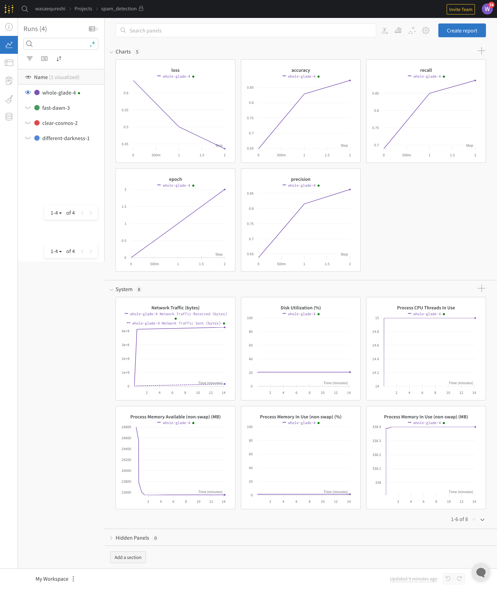
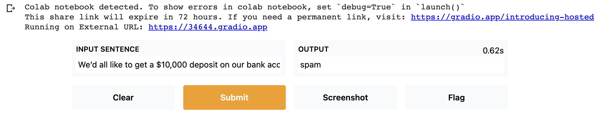

# HW 3 Explanation

### Source

I used the following links for each respective Bert assignment:

- [hw_3_bert_disaster](https://www.kaggle.com/xhlulu/disaster-nlp-keras-bert-using-tfhub/notebook)
- [hw_3_bert_github_bug_feature_question](https://www.analyticsvidhya.com/blog/2020/10/simple-text-multi-classification-task-using-keras-bert/)
- [hw_3_bert_ner](https://www.depends-on-the-definition.com/named-entity-recognition-with-bert/)
- [hw_3_bert_sentiment_analysis](https://towardsdatascience.com/sentiment-analysis-in-10-minutes-with-bert-and-hugging-face-294e8a04b671)
- [hw_3_bert_spam_classification](https://www.analyticsvidhya.com/blog/2021/09/performing-email-spam-detection-using-bert-in-python/)

There was some copying and pasting and but additional code that needed to be added in order to make them work. 

Each directory has an ipynb file which shows the implementation. I took a screenshot of both the wandb and gradio and added those as well. I will showcase them below:

### [hw_3_bert_disaster](https://github.com/wasaequreshi/CMPE-297-ET/blob/master/hw3/hw_3_bert_disaster/hw_3_bert_disaster.ipynb)

### [hw_3_bert_github_bug_feature_question](https://github.com/wasaequreshi/CMPE-297-ET/blob/master/hw3/hw_3_bert_disaster/hw_3_bert_disaster.ipynb)

### hw_3_bert_ner

### hw_3_bert_sentiment_analysis

### hw_3_bert_spam_classification

### Demo

Please take a look at the ipynb files. Additionally please look at the images as well :)